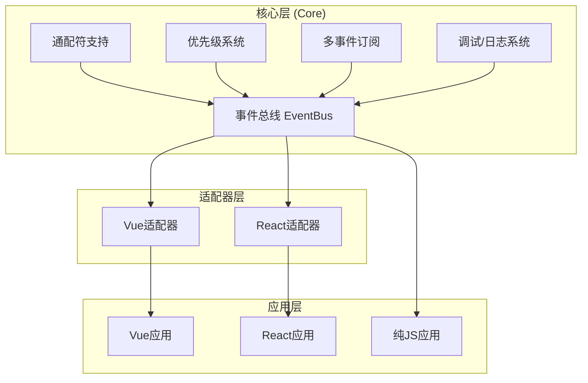

# Trame.js

<div align="center">
  <h3>轻量级跨框架组件通信库</h3>
  <p>强大、高效的事件驱动通信解决方案，无依赖、跨框架、体积小</p>
</div>

## 📖 简介

Trame.js 是一个超轻量级的跨框架组件通信库，名称取自英文 "Tram"（有轨电车），象征数据在组件间的有序传递。它专为 Vue 和 React 应用设计，解决跨组件通信问题，同时保持极小的体积和简洁的 API。

## ⚙️ 核心特性

- **超轻量**：核心+适配器 < 1.2KB (gzip)
- **零依赖**：单文件实现，不依赖任何第三方库
- **通配符支持**：使用 `*` 进行灵活的事件模式匹配
- **多事件订阅**：同时监听多个事件，支持一次性多事件订阅
- **优先级系统**：精确控制事件处理函数的执行顺序
- **智能生命周期管理**：自动清理订阅，防止内存泄漏
- **跨框架**：同时支持 Vue 和 React，API 一致
- **高性能**：使用 Map 和 Set 优化，缓存机制提升性能
- **完整调试系统**：内置日志、监控和调试工具

## 🏗️ 架构设计



## 💻 基本用法

### 安装

```bash
# 使用npm
npm install trame

# 使用yarn
yarn add trame

# 使用pnpm
pnpm add trame
```

### 基础事件订阅

```javascript
import { eventBus } from 'trame';

// 订阅事件
const unsubscribe = eventBus.on('user.login', (userData) => {
  console.log('用户登录:', userData);
});

// 触发事件
eventBus.emit('user.login', { id: '123', name: '张三' });

// 取消订阅
unsubscribe();
```

### 一次性订阅

```javascript
eventBus.once('notification', (message) => {
  console.log('收到通知:', message);
});
```

### 通配符事件

```javascript
// 订阅所有用户相关事件
eventBus.on('user.*', (eventName, userData) => {
  console.log(`触发用户事件: ${eventName}`, userData);
});

// 可以匹配 user.login, user.logout, user.update 等
eventBus.emit('user.login', { id: '123' });
```

### 事件优先级

```javascript
// 高优先级处理函数
const id1 = eventBus.on('form.submit', (data) => {
  console.log('表单验证');
}, 100); // 最高优先级

// 普通优先级处理函数
const id2 = eventBus.on('form.submit', (data) => {
  console.log('提交数据');
}, 50); // 默认优先级

// 修改处理函数优先级
eventBus.setPriority('form.submit', id2, 75);

// 查看优先级信息
const priorities = eventBus.getPriorities('form.submit');
```

### 多事件订阅

```javascript
// 同时订阅多个事件
const unsubscribeAll = eventBus.onMany(
  ['user.login', 'user.register', 'user.logout'],
  (eventName, data) => {
    console.log(`用户事件: ${eventName}`, data);
  }
);

// 任一事件触发后自动取消所有订阅
eventBus.onceMany(
  ['payment.success', 'payment.failure'],
  (eventName, data) => {
    console.log(`支付结果: ${eventName}`, data);
  }
);
```

## 📚 框架集成

### Vue 集成

```javascript
import { useVueEventBus } from 'trame/vue';
import { ref } from 'vue';

export default {
  setup() {
    const user = ref(null);
    const { on, emit } = useVueEventBus();

    // 订阅事件
    on('user.update', (userData) => {
      user.value = userData;
    });

    // 组件卸载时自动清理订阅
    const updateUser = () => {
      emit('user.update', { name: '李四', id: '456' });
    };

    return { user, updateUser };
  }
};
```

### React 集成

```jsx
import React, { useState } from 'react';
import { useReactEventBus } from 'trame/react';

function UserProfile() {
  const [user, setUser] = useState(null);
  const { on, emit } = useReactEventBus();

  // 订阅事件并在组件卸载时自动清理
  on('user.select', (userData) => {
    setUser(userData);
  });

  const selectUser = () => {
    emit('user.select', { name: '王五', id: '789' });
  };

  return (
    <div>
      {user ? <h3>{user.name}</h3> : <p>未选择用户</p>}
      <button onClick={selectUser}>选择用户</button>
    </div>
  );
}
```

## 🔍 高级特性

### 调试系统

```javascript
// 配置日志级别
eventBus.setOptions({
  enableDebug: true,
  logLevel: 'DEBUG',
  logEventData: true
});

// 获取事件监控数据
eventBus.debug.startMonitoring();
// ... 触发一些事件
const report = eventBus.debug.stopMonitoring();
console.log(report);

// 设置事件断点
eventBus.debug.setBreakpoint('payment.process', {
  condition: (event, data) => data.amount > 1000,
  callback: (event, data) => console.log('大额支付:', data)
});
```

### 性能指标监控

```javascript
// 获取性能指标
const metrics = eventBus.getMetrics();
console.log('缓存命中率:', metrics.cacheHitRate);
console.log('事件数量:', metrics.eventCount);
```

## 📊 API 文档

### 核心 API

| 方法 | 参数 | 返回值 | 描述 |
|------|------|--------|------|
| `on` | `(event, handler, options?)` | `Number/Function` | 订阅事件，返回处理函数ID或取消订阅函数 |
| `once` | `(event, handler, options?)` | `Number/Function` | 订阅一次性事件，触发后自动取消订阅 |
| `onMany` | `(events, handler, options?)` | `Function` | 订阅多个事件，返回组合的取消订阅函数 |
| `onceMany` | `(events, handler, options?)` | `Function` | 订阅多个一次性事件，任一触发后取消所有 |
| `off` | `(event, handler)` | `void` | 取消特定事件的订阅 |
| `emit` | `(event, ...args)` | `void` | 触发事件，传递参数给所有订阅者 |
| `setPriority` | `(event, handler, priority)` | `boolean` | 设置事件处理函数的优先级 |
| `getPriorities` | `(event)` | `Array` | 获取事件处理函数的优先级信息 |

### 选项配置

```javascript
eventBus.setOptions({
  // 基础配置
  enableDebug: true,        // 启用调试模式
  maxWildcardsPerPattern: 5, // 每个模式最大通配符数量
  unifyParams: false,       // 是否统一参数格式
  defaultPriority: 50,      // 默认优先级

  // 日志配置
  logLevel: 'INFO',         // 日志级别 (NONE|ERROR|WARN|INFO|DEBUG|TRACE)
  logNamespace: 'myApp',    // 日志命名空间
  logTimestamps: true,      // 是否记录时间戳
  logEventData: true,       // 是否记录事件数据
  maxLogEntries: 1000       // 最大日志条目数
});
```

## 🚀 性能优化

1. **缓存机制**
   - 通配符匹配结果缓存
   - 正则表达式缓存
   - 自动缓存清理

2. **高效数据结构**
   - Map/Set O(1) 时间复杂度操作
   - 按优先级排序的处理函数数组

3. **内存管理**
   - 自动清理订阅
   - 智能引用释放
   - 防止内存泄漏

4. **执行优化**
   - 通配符前缀快速检查
   - 处理函数快照避免迭代中修改
   - 错误隔离避免影响其他处理函数

## 📄 许可证

MIT License

---

<div align="center">
  <p>用 ❤️ 制作</p>
</div>
