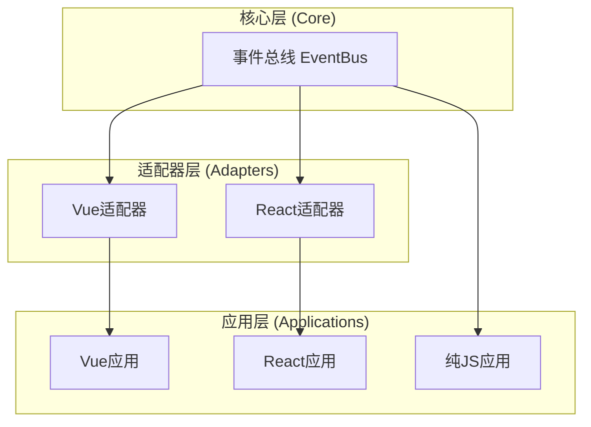

# Trame.js

<div align="center">
  <h3>轻量级跨框架组件通信库</h3>
  <p>组件间通信的极简解决方案，无依赖、跨框架、体积小</p>

  
  
  
</div>

## 📋 目录

- [简介](#-简介)
- [安装](#-安装)
- [快速开始](#-快速开始)
- [API文档](#-api文档)
- [使用示例](#-使用示例)
- [高级特性](#-高级特性)
- [常见问题](#-常见问题)
- [贡献指南](#-贡献指南)
- [许可证](#-许可证)

## 📖 简介

Trame.js 是一个超轻量级的跨框架组件通信库，专为解决 Vue 和 React 应用中的跨组件通信问题设计，同时保持极小的体积和简单的API。

**核心特性：**

- **超轻量**：核心+适配器 < 1.2KB (gzip)
- **零依赖**：单文件实现，不依赖任何第三方库
- **智能生命周期管理**：自动清理订阅，防止内存泄漏
- **跨框架**：同时支持Vue和React，API一致
- **高性能**：使用Map和Set优化，O(1)复杂度操作

## 📦 安装

```bash
# 使用npm
npm install trame

# 使用yarn
yarn add trame

# 使用pnpm
pnpm add trame
```

## 🚀 快速开始

### Vue 使用

```javascript
import { useVueEventBus } from 'trame';

// 在组件setup中
const { on, once, emit } = useVueEventBus();

// 订阅事件
on('message', (data) => {
  console.log('收到消息:', data);
});

// 发送事件
emit('message', { text: '你好，世界！' });
```

### React 使用

```javascript
import { useReactEventBus } from 'trame';

// 在函数组件中
const { on, once, emit } = useReactEventBus();

// 订阅事件
React.useEffect(() => {
  const unsubscribe = on('message', (data) => {
    console.log('收到消息:', data);
  });

  // 组件卸载时自动清理（也可以手动清理）
  return () => unsubscribe();
}, [on]);

// 发送事件
const sendMessage = () => {
  emit('message', { text: '你好，世界！' });
};
```

### 原生 JavaScript 使用

```javascript
import { createEventBus } from 'trame';

const eventBus = createEventBus();

// 订阅事件
const unsubscribe = eventBus.on('message', (data) => {
  console.log('收到消息:', data);
});

// 发送事件
eventBus.emit('message', { text: '你好，世界！' });

// 手动取消订阅
unsubscribe();
```

## 📚 API文档

### 核心 API

| 方法 | 参数 | 返回值 | 描述 |
|------|------|--------|------|
| `on` | `(event: string, handler: Function)` | `Function` | 订阅事件，返回取消订阅函数 |
| `once` | `(event: string, handler: Function)` | `Function` | 订阅一次性事件，触发后自动取消订阅 |
| `off` | `(event: string, handler: Function)` | `void` | 取消特定事件的订阅 |
| `emit` | `(event: string, ...args: any[])` | `void` | 触发事件，传递参数给所有订阅者 |

### Vue适配器 API

```javascript
const { on, once, emit } = useVueEventBus();
```

- **`useVueEventBus`**: Vue组合式API，提供与组件生命周期绑定的事件总线功能
- 组件卸载时自动清理所有订阅

### React适配器 API

```javascript
const { on, once, emit } = useReactEventBus();
```

- **`useReactEventBus`**: React Hook，提供与组件生命周期绑定的事件总线功能
- 组件卸载时自动清理所有订阅

## 🔍 使用示例

### 场景一：通知系统

```jsx
// NotificationCenter.jsx (React示例)
import React, { useState } from 'react';
import { useReactEventBus } from 'trame';

export const NotificationCenter = () => {
  const { on } = useReactEventBus();
  const [messages, setMessages] = useState([]);

  React.useEffect(() => {
    const unsubscribe = on('notification', (message) => {
      setMessages(prev => [...prev, message]);
    });
    return () => unsubscribe();
  }, [on]);

  return (
    <div className="notification-center">
      {messages.map((msg, idx) => (
        <div key={idx} className="notification">{msg}</div>
      ))}
    </div>
  );
};

// 在任意其他组件中发送通知
import { useReactEventBus } from 'trame';

const { emit } = useReactEventBus();
emit('notification', '操作成功！');
```

### 场景二：主题切换

```javascript
// 在Vue中的使用示例
import { useVueEventBus } from 'trame';

// ThemeSwitcher.vue
const { emit } = useVueEventBus();

const toggleTheme = () => {
  emit('theme-change', isDark ? 'light' : 'dark');
};

// 在其他任意组件中
const { on } = useVueEventBus();

on('theme-change', (theme) => {
  document.body.className = theme;
});
```

## 🔬 高级特性

### 架构设计



### 性能优化

Trame.js 采用了多项性能优化措施：

1. **高效数据结构**：使用 `Map` 和 `Set` 实现 O(1) 复杂度的事件操作
2. **自动内存管理**：组件卸载时自动清理订阅，防止内存泄漏
3. **批量处理**：使用快照机制，防止在回调执行过程中修改集合导致的问题

### 核心实现

```javascript
// 核心事件总线（<500B）
const createEventBus = () => {
  const events = new Map();

  return {
    on(event, handler) {
      if (!events.has(event)) events.set(event, new Set());
      events.get(event).add(handler);
      return () => this.off(event, handler);
    },

    once(event, handler) {
      const onceHandler = (...args) => {
        handler(...args);
        this.off(event, onceHandler);
      };
      return this.on(event, onceHandler);
    },

    off(event, handler) {
      if (!events.has(event)) return;
      events.get(event).delete(handler);
    },

    emit(event, ...args) {
      if (!events.has(event)) return;
      [...events.get(event)].forEach(h => h(...args));
    }
  };
};
```

## 🤔 常见问题

### Q: Trame.js 与 Redux/Vuex 等状态管理库有何不同？

A: Trame.js 专注于轻量级事件通信，不提供状态持久化和中间件等功能，适合简单通信场景，可与其他状态管理方案共存。

### Q: 是否支持跨应用通信？

A: 基础版本主要用于单应用内通信，但可以通过自定义适配器扩展支持跨iframe、微前端等场景。

### Q: 是否支持异步事件？

A: 支持。可以在事件处理函数中使用 async/await 或 Promise。

## 🤝 贡献指南

欢迎贡献代码或文档改进！请遵循以下步骤：

1. Fork 仓库
2. 创建分支：`git checkout -b feature/your-feature`
3. 提交更改：`git commit -m 'Add some feature'`
4. 推送到分支：`git push origin feature/your-feature`
5. 提交 Pull Request

## 📄 许可证

MIT License

---

<div align="center">
  <p>Trame.js - 用❤️制作</p>
  <p>
    <a href="https://github.com/yourusername/trame">GitHub</a> ·
    <a href="https://www.npmjs.com/package/trame">NPM</a> ·
    <a href="https://twitter.com/yourusername">Twitter</a>
  </p>
  <p>Copyright © 2023-2024 - 保留所有权利</p>
</div>
