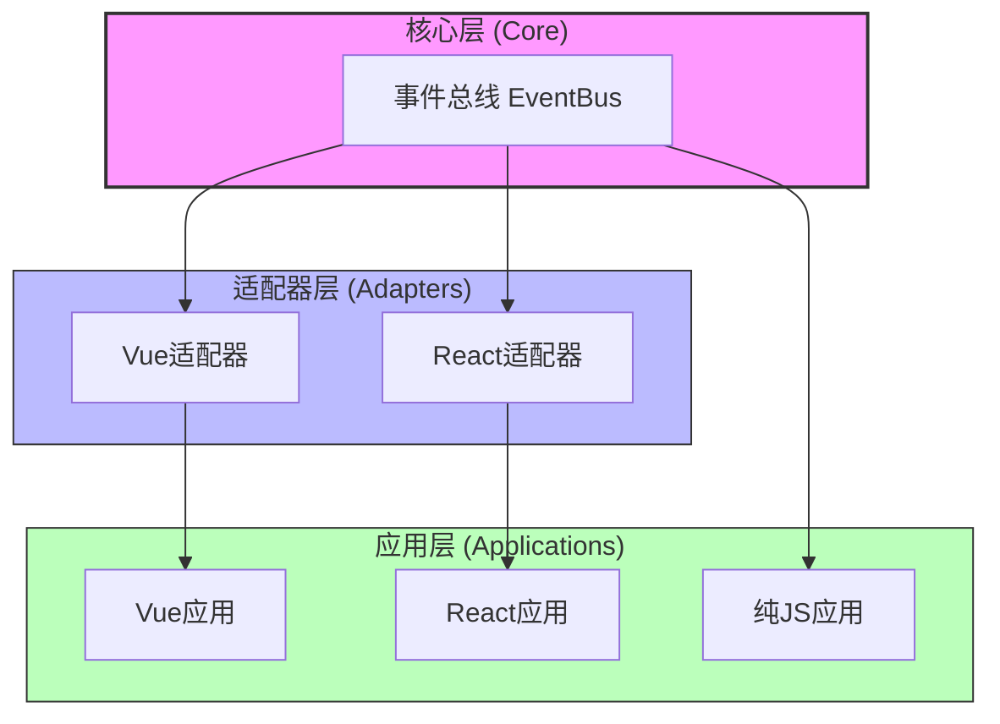
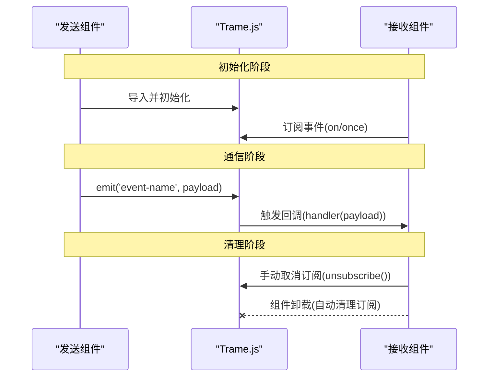
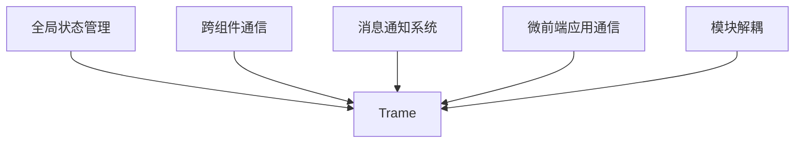
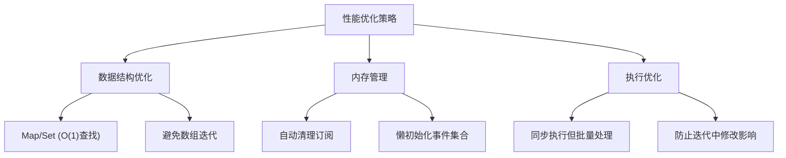

# Trame.js

<div align="center">
  <h3>轻量级跨框架组件通信库</h3>
  <p>组件间通信的极简解决方案，无依赖、跨框架、体积小</p>
</div>

## 📖 简介

Trame.js 是一个超轻量级的跨框架组件通信库，名称取自英文 "Tram"（有轨电车），象征数据在组件间的有序传递。它专为Vue和React应用设计，解决跨组件通信问题，同时保持极小的体积和简单的API。

## ⚙️ 核心特性

- **超轻量**：核心+适配器 < 1.2KB (gzip)
- **零依赖**：单文件实现，不依赖任何第三方库
- **智能生命周期管理**：自动清理订阅，防止内存泄漏
- **跨框架**：同时支持Vue和React，API一致
- **高性能**：使用Map和Set优化，O(1)复杂度操作

## 🏗️ 架构设计



## 💻 核心实现

### 事件总线 (Core)

```javascript
// 核心事件总线（<500B）
const createEventBus = () => {
  const events = new Map();

  return {
    on(event, handler) {
      if (!events.has(event)) events.set(event, new Set());
      events.get(event).add(handler);
      return () => this.off(event, handler);
    },

    once(event, handler) {
      const onceHandler = (...args) => {
        handler(...args);
        this.off(event, onceHandler);
      };
      return this.on(event, onceHandler);
    },

    off(event, handler) {
      if (!events.has(event)) return;
      events.get(event).delete(handler);
    },

    emit(event, ...args) {
      if (!events.has(event)) return;
      [...events.get(event)].forEach(h => h(...args));
    }
  };
};

const eventBus = createEventBus();
```

### Vue 适配器

```javascript
// Vue 适配器（<300B）
const useVueEventBus = () => {
  const subscriptions = new Set();

  const on = (event, handler) => {
    const unsubscribe = eventBus.on(event, handler);
    subscriptions.add(unsubscribe);
    return unsubscribe;
  };

  onUnmounted(() => {
    subscriptions.forEach(u => u());
    subscriptions.clear();
  });

  return { on, once: eventBus.once, emit: eventBus.emit };
};
```

### React 适配器

```javascript
// React 适配器（<400B）
const useReactEventBus = () => {
  const subsRef = useRef(new Set());

  useEffect(() => () => {
    subsRef.current.forEach(u => u());
    subsRef.current.clear();
  }, []);

  const on = (event, handler) => {
    const unsubscribe = eventBus.on(event, handler);
    subsRef.current.add(unsubscribe);
    return unsubscribe;
  };

  return { on, once: eventBus.once, emit: eventBus.emit };
};
```

## 📊 数据流图



## 📚 API 文档

### 核心 API

| 方法 | 参数 | 返回值 | 描述 |
|------|------|--------|------|
| `on` | `(event: string, handler: Function)` | `Function` | 订阅事件，返回取消订阅函数 |
| `once` | `(event: string, handler: Function)` | `Function` | 订阅一次性事件，触发后自动取消订阅 |
| `off` | `(event: string, handler: Function)` | `void` | 取消特定事件的订阅 |
| `emit` | `(event: string, ...args: any[])` | `void` | 触发事件，传递参数给所有订阅者 |

### 框架特定 API

#### Vue

```javascript
// 在Vue组件中使用
import { useVueEventBus } from 'trame';

// 在setup中
const { on, once, emit } = useVueEventBus();
```

#### React

```javascript
// 在React组件中使用
import { useReactEventBus } from 'trame';

// 在函数组件中
const { on, once, emit } = useReactEventBus();
```

## 🌟 使用场景


### 场景一：通知中心

跨多层级组件实现通知功能，无需层层传递props或context。

### 场景二：主题切换

实现全局主题切换功能，一处修改，全局生效。

### 场景三：用户认证状态

管理用户登录/登出状态，跨组件同步认证信息。

### 场景四：微前端通信

在微前端架构中实现跨应用模块的通信。

## 🔍 示例代码

### Vue 示例

```vue
<template>
  <div class="user-card">
    <h3>{{ user.name }}</h3>
    <p>User ID: {{ user.id }}</p>
    <button @click="updateUser">更新用户</button>
  </div>
</template>

<script setup>
import { ref } from 'vue';
import { useVueEventBus } from 'trame';

const { on, emit } = useVueEventBus();
const user = ref({ id: '123', name: '张伟' });

on('user-updated', (newUser) => {
  user.value = newUser;
});

const updateUser = () => {
  emit('user-updated', {
    id: '456',
    name: '李娜'
  });
};
</script>

<style scoped>
.user-card {
  border: 1px solid #e2e8f0;
  border-radius: 8px;
  padding: 16px;
  margin-bottom: 16px;
  box-shadow: 0 1px 3px rgba(0, 0, 0, 0.1);
}

button {
  background-color: #4299e1;
  color: white;
  border: none;
  padding: 8px 16px;
  border-radius: 4px;
  cursor: pointer;
  margin-top: 12px;
}

button:hover {
  background-color: #3182ce;
}
</style>
```

### React 示例

```jsx
import React, { useState, useEffect } from 'react';
import { useReactEventBus } from 'trame';

const NotificationCenter = () => {
  const { on } = useReactEventBus();
  const [notifications, setNotifications] = useState([]);

  useEffect(() => {
    const handleNotification = (msg) => {
      setNotifications(prev => [...prev, { id: Date.now(), message: msg }]);
    };

    const unsubscribe = on('new-notification', handleNotification);
    return () => unsubscribe();
  }, [on]);

  return (
    <div className="notification-center">
      <h3>通知中心</h3>
      <div className="notifications">
        {notifications.map(n => (
          <div key={n.id} className="notification">
            {n.message}
          </div>
        ))}
      </div>
    </div>
  );
};

const NotificationSender = () => {
  const { emit } = useReactEventBus();
  const [message, setMessage] = useState('');

  const sendNotification = () => {
    if (message) {
      emit('new-notification', message);
      setMessage('');
    }
  };

  return (
    <div className="sender">
      <input
        type="text"
        value={message}
        onChange={(e) => setMessage(e.target.value)}
        placeholder="输入通知内容"
      />
      <button onClick={sendNotification}>发送通知</button>
    </div>
  );
};
```

## 📦 安装与使用

### 安装

```bash
# 使用npm
npm install trame

# 使用yarn
yarn add trame

# 使用pnpm
pnpm add trame
```

### 导入

```javascript
// ES模块导入
import { createEventBus, useVueEventBus, useReactEventBus } from 'trame';

// 按需导入
import { useVueEventBus } from 'trame/vue';
import { useReactEventBus } from 'trame/react';
```

## 🚀 性能优化技术





### 性能优化措施详解

1. **高效数据结构**：
   - 使用 `Map` 存储事件，`Set` 存储处理函数
   - O(1) 复杂度的订阅/取消订阅操作

2. **智能内存管理**：
   - 组件卸载时自动清理订阅
   - 仅在需要时创建事件集合

3. **批量处理优化**：
   - 使用 `[...events.get(event)]` 创建处理函数快照
   - 防止在回调执行过程中修改集合导致的问题

## 📁 文件结构

```
trame.js/
├── package.json           # 包配置
├── rollup.config.js       # 构建配置
├── src/
│   ├── index.js           # 主入口
│   ├── core.js            # 事件总线核心
│   ├── vue.js             # Vue适配器
│   └── react.js           # React适配器
└── README.md              # 文档
```

## 📦 NPM 发布配置

```json
{
  "name": "trame",
  "version": "1.0.0",
  "description": "超轻量跨框架组件通信库",
  "main": "dist/trame.cjs.js",
  "module": "dist/trame.esm.js",
  "files": ["dist"],
  "keywords": ["event-bus", "vue", "react", "communication", "lightweight"],
  "peerDependencies": {
    "vue": ">=2.7.0 || >=3.0.0",
    "react": ">=16.8.0"
  }
}
```

## 🤔 常见问题

### Q: Trame.js 与 Redux/Vuex 等状态管理库有何不同？

A: Trame.js 专注于轻量级事件通信，不提供状态持久化和中间件等功能，适合简单通信场景，可与其他状态管理方案共存。

### Q: 是否支持跨应用通信？

A: 基础版本主要用于单应用内通信，但可以通过自定义适配器扩展支持跨iframe、微前端等场景。

### Q: 是否支持异步事件？

A: 支持。可以在事件处理函数中使用 async/await 或 Promise。

## 🤝 贡献指南

欢迎贡献代码或文档改进！请遵循以下步骤：

1. Fork 仓库
2. 创建分支：`git checkout -b feature/your-feature`
3. 提交更改：`git commit -m 'Add some feature'`
4. 推送到分支：`git push origin feature/your-feature`
5. 提交 Pull Request

## 📄 许可证

MIT License

---

<div align="center">
  <p>codefish用❤️制作</p>
  <p>
    <a href="https://github.com/yourusername/trame">GitHub</a> ·
    <a href="https://www.npmjs.com/package/trame">NPM</a>
  </p>
</div>
